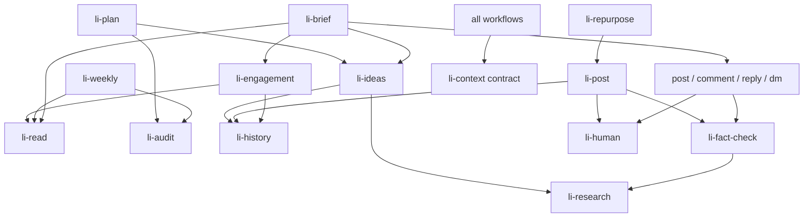
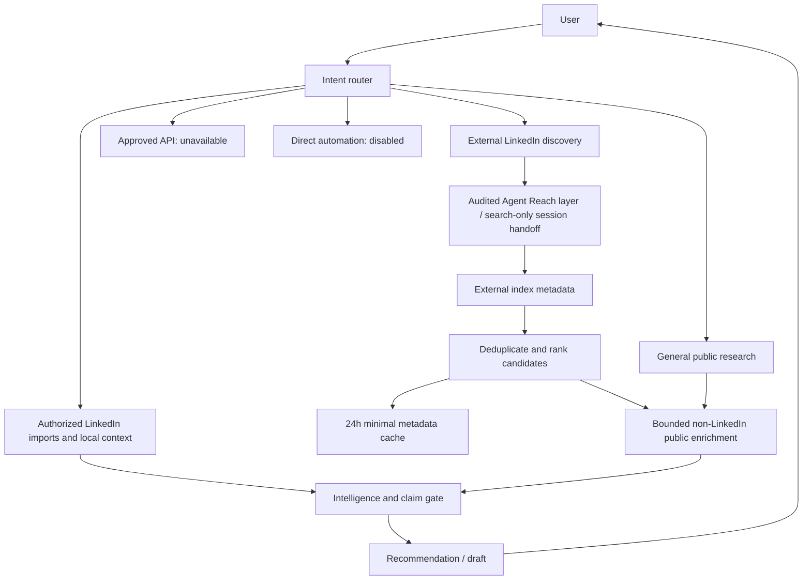

# LinkedIn Intelligence Agent architecture

## Account-reading scope update

The [restricted account connector](docs/ACCOUNT_CONNECTOR.md) is an explicit bounded own-profile/posts/feed
read exception to the earlier import-only scope. It calls pinned mcp-server-linkedin
directly through a project gateway; Agent Reach remains in research/discovery.
Generic providers still cannot fetch/login to LinkedIn, external discovery stays
separate, inbox is excluded and all write actions remain disabled. Earlier audits
and zero-access observations describe their original validation, not this new path.


Twenty focused skill entrypoints use progressive loading. Name/description route
the request; SKILL.md loads relevant references only. Installed skills are siblings;
shared resources stay inside the pack so installed copies need no repository-root
resources. Composition means applying sibling instructions, not an invented skill-call
API, recursive invocation or automatic agent spawning.

## Files and layers

```text
plugin.json                         portable distribution identity
skills/
  li-{post,comment,reply,profile,plan,human,carousel,repurpose,dm,inbox,audit}/
  li-{context,fact-check,research,history,ideas,read,brief,engagement,weekly}/
    SKILL.md                        focused workflow
    agents/openai.yaml              implicit invocation and UI metadata
  li-post/references/hooks.json      21 editorial options
  li-profile/references/rubric.json  12 criteria / 100 points
  li-human/scripts/                  humanize.py, detect.py
  li-human/references/slop.json      normalization and structural preferences
  li-context/references/             shared context/trust/approval contract
  li-context/templates/              14 starter files
  li-context/scripts/context.py      initialization/status/publication history
  li-read/scripts/models.py          normalized schema, provenance, freshness
  li-read/scripts/read_layer.py      local providers, routing, cache, import/purge
  li-read/scripts/intelligence.py    attention, weekly review, combined memory
  li-read/references/                source and normalization contract
  li-read/assets/                    fictional read example
  li-brief/references/               attention and relationship guidance
  li-fact-check/references/          claim classification/permission gate
  li-research/references/            optional source/tool routing
  li-history/references/             confirmed publication schema
templates/                          voice convenience copy, publication example
scripts/                            complete-pack installer, disposable demo
tests/                              original toolkit and intelligence tests
```

Private project data is independent of installation:

```text
.linkedin-agent/
  identity/     voice.md, bio.md, audience.md
  knowledge/    companies.md, projects.md, claims.md, metrics.md
  history/      posts.jsonl, comments.jsonl, topics.json
  analytics/    performance.csv
  sources.json, relationships.json, priorities.json
  imports/      authorized input receipts
  read/         cache.json
  discovery/    cache.json, validation.json (temporary metadata / receipt)
```

## Dependency graph



Results can feed later workflows without recursively invoking their entrypoints.
The shared contract links read guidance for relevant context retrieval; this is a
resource reference, not an instruction to re-enter the daily-brief pipeline.

## Data flows

Writing: user idea → relevant context and available read evidence → identify claims
→ minimal research when necessary → combined history overlap → flexible structure
→ voice-aware draft → factuality/public-permission gate → quality edits → recheck
changed claims → human review → manual publication → separately confirmed history.

Intelligence: capability check → authorized source receipts → normalized data with
provenance → incremental cache/freshness → relationship and priority context →
transparent attention classification → Codex semantic review → 0–5 useful actions
and grounded drafts → human execution. Weekly review separates observed activity
from confirmed publication and presents experiments, not causal success claims.

## Read layer

`ReadProvider.read(capability)` is a read-only protocol. The included FileProvider
reads configured imports; the separate optional account gateway supplies actual
live receipts to the same normalized layer. Source-type labels
represent receipts, not account access. Routing prioritizes supported integration
receipts, exports, public retrieval, supplied material, then optional connectors;
errors, partial and stale coverage trigger fallback. Capability status distinguishes
absence from explicitly complete empty results and preserves failed refresh notes.

Allowlisted profile/post/comment/person/analytics/message/research models preserve
unknown fields as null and drop opaque raw data. Provenance retains source/provider,
identifier, retrieval time, optional URL/confidence and visibility. Assessments and
recommendations are separate from source facts. WEB-VERIFIED is an operator/agent
attestation after source review, never Python proof of truth.

Cache keys include provider/kind/capability/id; canonical hashes detect changes.
Newer complete snapshots retire absent records; partial snapshots never do. Old
snapshots cannot overwrite or revive newer state. Active records serve current
attention; retired own-post observations can still support content memory. A refresh
never silently writes confirmed publication history or public claims.

Freshness defaults vary by kind; undated/future activity cannot generate timely
recommendations. Mode reflects supplied evidence coverage; no mode implies a tested
live account connection. Purge previews and deletes only imported receipts/cache.

## Deterministic versus semantic work

Humanization protects URL/email spans, preserves case and meaningful Unicode, and
applies longest-first vocabulary rules. Existing output is refused. The analyzer
reports observable style patterns with voice/evidence unmeasured; no human score.

`context.py` adds missing templates, validates history, appends only attested actual
publications, locks Unix append writers and joins descriptive metrics by ID. Token
overlap is transparent; Codex decides whether new evidence/angles are distinctive.

`intelligence.py` combines confirmed history and observed own posts without promoting
observations to confirmed logs. It selects known own-thread questions, relevant
contributions and explicit curated obligations, suppressing resolved/repetitive/stale
activity. Its numeric ordering is inferred. It cannot infer genuine expertise,
relationship importance, factual validity or opportunity probability from nothing.
CLI draft fields are placeholders; li-brief applies the original writing skills to
produce actual drafts from available evidence. Strategic metrics are used only when
provided; impressions alone do not define success.

## Security boundaries

Python is local, standard-library-only: no network, credentials, subprocess or
executable data. Session tools are a separate optional research boundary and receive
minimal public queries. There are no LinkedIn write methods; the dedicated optional account gateway
provides bounded manually authenticated reads.
Human approval never triggers an account action.

Data paths reject traversal/interior symlinks. New cache files/directories have private
Unix permissions; private imports require opt-in and default brief/show omit them.
One cache writer at a time is required. Parent races, resource exhaustion, undetected
secrets in valid text and model disclosure remain trusted-workspace risks; see
SECURITY.md. Prompt gates require agent/human judgment and cannot certify truth or
prevent a user copying an unresolved draft.

## Optional developer web stack

The core pack above remains dependency-free. tools/web adds a separate pinned uv/npm
retrieval environment and fixed stdio launchers, registered in generated local
.codex/config.toml. Scrapling is primary content retrieval; Playwright handles
interaction; Agent Reach stays specialist; Bright Data is a disabled managed
fallback. See docs/CODEX_WEB_TOOLING.md. This optional layer can network and launch
reviewed dependencies; it does not alter core helper behavior or grant LinkedIn
account actions. Project routing lives in AGENTS.md, and installed pack research
references retain graceful operation without optional tools.

## Unified orchestration

Intent → focused intelligence skill → local context/history + separate li-read →
explicit public research need → li-research capability router → one retrieval
provider → normalized evidence/cache → relevant inferred signals → claim and public
permission gate → reasoning, history/voice/quality → human-ready output.

`skills/li-research/scripts/orchestrator.py` owns selection and bounded sequential
execution; `evidence.py` owns models, hash/URL/platform deduplication, task freshness
and assessments. `tools/web/research.py` connects installed optional providers.
Provider health never grants LinkedIn access. Daily brief returns research_signals
separately from supported LinkedIn actions; semantic ranking stays with Codex.
See docs/ORCHESTRATION.md for the complete request and evidence contract.

## Release-gate clarifications

LinkedIn duplicate review views retain all source observations while choosing the
newest canonical item. The default brief filters private read items before merging.
The weekly helper uses the same rolling seven-day UTC window for confirmed history
and dated imports; date-only history is interpreted at UTC midnight. Voice and
claim gates remain semantic skill work rather than tested model classifiers.
Provider health is an offline receipt view with explicit recent failures, never a
live reachability assertion. See [the current release audit](docs/V1_RELEASE_AUDIT.md).

## LinkedIn discovery boundary

The current [discovery guide](docs/LINKEDIN_DISCOVERY.md) and
[product limits](docs/POLICY_LIMITS.md) supersede the earlier 10/50 model.
GREEN authorized imports/local history and ordinary non-LinkedIn research retain
resource-based limits. AMBER external discovery defaults to 25 candidates, maximum
100 unique per task, normal 1–3 queries (budget 3), hard maximum 10. Automatic public
source enrichment defaults to 10 candidates, maximum 20. RED direct scraping and
account actions remain disabled/zero; approved API is distinct and unavailable.

Discovery is PARTIAL when a search-only Codex session tool supplies actual metadata.
Agent Reach is preferred where audited; its installed Exa content-returning transport
remains disabled. Standalone Python does not call native session tools. The local
`discovery_workflow.py` handoff validates metadata, TTL cache and enrichment receipts;
it makes no network calls. Ordinary provider routing serves non-LinkedIn sources.
Identity matches are inferred and claims still require li-fact-check.

The ignored discovery cache defaults to 24h (accepted 1–72h), maximum 20 active task
entries. Expired entries are removed on access/write or explicit purge; idle files
require that command for physical deletion. Full public enrichment content never
enters this cache. No candidate automatically becomes a relationship/profile fact.
All existing URL, redirect, isolated-browser and public-input guards remain active.
The controls do not certify remote vendor egress or external tools outside this pack.



## Account data flow

Codex → five-tool restricted gateway → pinned upstream stdio server → dedicated
authenticated browser → bounded section evidence in the active session → Codex
semantic normalization → existing read envelope validation → private observations
and dated OBSERVED/INFERRED summaries → brief/ideas/draft skills → human execution.

Tools/linkedin is an isolated optional environment. Core account_context.py remains
stdlib-only. No raw upstream catalogue/resources/prompts are forwarded. Onboarding
uses grouped section reads (5/3/2 scroll bounds, six calls); routine tasks use two
scrolls and four calls. Kill switch, TTL planning and independent capability/error
status separate access from cached context. No local observations amend confirmed
publication history or curated identity/claims automatically.

## Professional memory supplement

The shared li-context professional_memory.py layer adds an opaque local user ID,
versioned optional resume/bio/website/link sources, provenance, source precedence,
visible conflicts and durable corrections. The compatible layout remains one user
per project; multi-user browser switching is not implemented. Account authentication
and memory are separate. Normalized account retention feeds this API without new
network reads; confirmed history can supply derived topics without promoting account
observations to confirmed publication. Curated files remain authoritative.

New private memory files/directories use 0600/0700 and are ignored. Source documents
are referenced/hash-indexed rather than copied. Public retrieval stays in the existing
router. Parser/runtime trust and semantic extraction still require review; precedence
is not fact verification, public permission or proof of expertise. Removal deactivates
sources but retains private audit evidence. Explicit reset/export controls are scoped,
exclude authentication and do not remove external source files.

See [the memory guide](docs/PROFESSIONAL_MEMORY.md) and
[review](docs/PROFESSIONAL_MEMORY_REVIEW.md) for actual validation and limitations.
