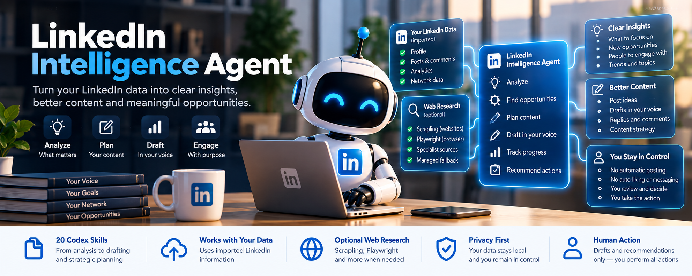

# LinkedIn Intelligence Agent



**Understand what matters on LinkedIn before deciding what to say or do.**

LinkedIn Intelligence Agent is a Codex-native professional intelligence toolkit that helps you turn your LinkedIn data, writing history, network context and external research into clearer decisions, better content and more meaningful engagement.

Its optional account connector reads your own LinkedIn profile, career sections,
recent own posts and a bounded feed sample to build reusable professional context.
It can analyze your observed or imported LinkedIn activity, identify worthwhile opportunities, research topics, check claims, remember what you've already said, draft in your voice and help you decide what deserves your attention.

You stay in control.

**The agent recommends and drafts. You perform every LinkedIn action yourself.**

---

## Start in the Codex desktop app

Open this repository as a local project in Codex. Install the 20 Skills and create
private context using the [Quickstart](docs/QUICKSTART.md), then ask:

> Set up my LinkedIn Intelligence Agent.

You sign in yourself in the connector's dedicated browser if needed. Signing in to
LinkedIn in another browser tab does not connect this gateway. After onboarding,
Codex reuses saved professional context for ordinary writing tasks. You do not need
to paste your profile or posts on the connected path.

There is no standalone app or background service to launch: the Skills run in your
Codex chat, and the optional account gateway supplies bounded reads. Comments,
inbox, connections and analytics require authorized additional data; the connector
currently reads only your own profile, own posts and a feed sample.

## First-run onboarding

**Connect → Learn → Enrich → Confirm → First Brief**

Codex offers LinkedIn connection first and can learn from bounded account reads.
You may instead continue with a CV, bio, website or authorized local context. Optional
sources enrich memory; Codex shows what it learned with observed/inferred/confirmed
labels so you can correct it. It asks only for missing goals and important audiences,
then delivers your first intelligence brief with 0–5 useful actions.

Setup progress survives interrupted chats. Completed users reuse local memory,
including offline, rather than repeating setup. A new account challenge pauses reads
without deleting context. See [Onboarding](docs/ONBOARDING.md).

After setup, use **Brief me**, **Create**, **Discover**, **Engage**, or **Review & Plan**.
These [five operational workflows](docs/WORKFLOWS.md) compose the existing 20 Skills;
onboarding adds no new Skill or sixth workflow.

## Reusable professional context

After connecting LinkedIn, the agent builds private local professional memory.
Optionally add a resume/CV, professional bio, personal website or other professional
links now or later. Ask “What do you know about me?”, “Add my resume”, or “Correct my
current role.” Conflicts and sources remain visible; user corrections persist.
Most writing/context tasks reuse local memory and need no fresh account access.

See [the memory guide](docs/PROFESSIONAL_MEMORY.md) for source management, privacy, export and reset.

## What it can do

### Analyse your LinkedIn presence

Review account-observed profile/posts/feed, plus optional imported:

- profile information
- posts
- comments
- analytics
- network context
- relationship notes

Use that information to identify patterns, gaps, opportunities and areas that deserve attention.

---

### Give you a daily LinkedIn brief

Ask:

> Review my LinkedIn and tell me what deserves my attention today.

The agent can help identify:

- comments worth replying to
- conversations worth joining
- people worth engaging with
- potential follow-ups
- useful industry signals
- topics worth posting about
- things you can safely ignore

Comment/reply recommendations need supplied or imported comments; inbox and relationship
recommendations need their corresponding authorized data. A feed sample does not
provide complete account coverage.

The goal is not to manufacture activity.

If nothing meaningful needs your attention, it should say so.

---

### Find worthwhile post ideas

Ask:

> Find me something worth posting about.

The agent can combine:

- your current work
- previous posts
- audience context
- topics you've already covered
- network signals
- current research
- community discussions
- available evidence

to find genuinely fresh angles.

It can also tell you when an idea is too repetitive or simply not strong enough to post.

---

### Draft in your voice

LinkedIn Intelligence Agent can learn from your real writing samples and use them as guidance for:

- posts
- replies
- comments
- direct-message drafts
- carousel copy
- profile rewrites
- content repurposing

It is designed to learn your style without simply copying your previous posts.

---

### Remember what you've already said

The agent maintains local content history so it can help answer questions like:

> Have I posted about this before?

> When did I last discuss this?

> Am I repeating this argument?

> Have I already used this story?

> Which topics am I overusing?

That makes it easier to create content that feels fresh rather than repetitive.

---

### Help you engage more thoughtfully

Ask:

> Who should I engage with today?

The agent can consider:

- topic relevance
- relationship context
- recent activity
- previous interactions
- whether you can contribute something useful
- whether engagement is actually warranted

Possible recommendations include:

- comment
- reply
- follow up
- read only
- no response needed

The aim is meaningful engagement, not engagement for visibility's sake.

---

### Research before you post

When a topic needs current information or factual verification, the agent can use an optional research layer.

The current research stack supports:

- **Scrapling** for ordinary webpage retrieval, extraction and crawling
- **Playwright** for browser interaction when clicking or dynamic navigation is genuinely required
- **Agent Reach** for selected specialist community and platform sources
- **Bright Data** as an optional managed fallback for difficult public retrieval

The router is designed to use the simplest and lowest-cost suitable method rather than launching every tool for every request.

---

### LinkedIn discovery and public research

Ask:

> Find 25 people on LinkedIn working on sports biomechanics, and research the most relevant candidates using public sources.

The agent can discover candidates through external search/index metadata, deduplicate
and rank them, then research a useful subset through university pages, papers,
company sites and other permitted public sources. Defaults are 25 candidates and
1–3 queries; hard task limits are 100 unique candidates and 10 queries. Automatic
public enrichment defaults to 10 candidates, maximum 20. Fresh minimal discovery
metadata can be reused for 24 hours.

**Current availability: PARTIAL in a Codex session with a search-only web tool.**
The session search handoff was validated with actual index results and a non-LinkedIn
source retrieved through Scrapling. Agent Reach remains the preferred audited
specialist discovery layer; its installed Exa content-returning transport stays
disabled because index-only behavior is unverified. Standalone Python has no live
search client; without a suitable session tool, discovery is unavailable.

The discovery workflow never opens candidate LinkedIn pages. The separate account
gateway can read your own profile/posts/feed. Search snippets are clues,
not verified profiles. Name matches alone do not establish identity. For inbox, network and analytics, supply authorized exports, snapshots or text;
the account connector does not add those reads.
Your own history, connections, comments and analytics are processed within normal
resource limits, independently of discovery caps. Approved API access is a separate
optional capability and currently unavailable. All LinkedIn actions remain yours.

Discovery limits are conservative product controls designed to prevent bulk
harvesting and unnecessary external requests. They are not LinkedIn-issued quotas
and do not create permission to scrape LinkedIn. See [the current discovery guide](docs/LINKEDIN_DISCOVERY.md)
and [product limits](docs/POLICY_LIMITS.md).

---

### Fact-check claims

The agent can distinguish between:

- user-provided information
- locally stored history
- retrieved evidence
- verified public claims
- opinion
- inference
- unsupported claims

It should not invent:

- revenue
- partnerships
- customer names
- awards
- scientific results
- user numbers
- product claims
- performance metrics
- credentials

If a claim cannot be supported, the agent should flag it, omit it or ask for verification.

---

### Review your profile

Ask:

> Audit my LinkedIn profile.

The agent can assess available profile information for:

- positioning
- headline clarity
- About section
- proof and credibility
- audience relevance
- stale information
- alignment with your current work
- opportunities to strengthen the profile

It drafts recommendations only.

It does not edit your LinkedIn account.

---

### Give you a weekly review

Ask:

> Do my weekly LinkedIn review.

The agent can help summarize:

- what you posted
- themes you covered
- meaningful responses
- people you interacted with
- conversations worth following up
- topics becoming repetitive
- themes you have neglected
- emerging opportunities
- priorities for the next week

---

## 20 focused Codex Skills

LinkedIn Intelligence Agent is built as a collection of focused Skills rather than one giant prompt.

Current capabilities include areas such as:

- daily briefing
- weekly review
- profile analysis
- content history
- post ideation
- post drafting
- comments
- replies
- DMs
- inbox triage
- engagement
- analytics
- content planning
- carousels
- repurposing
- research
- fact checking
- writing-quality review
- LinkedIn data import and reading
- context and voice management

You normally do **not** need to invoke individual Skills manually.

Just ask what you want to do.

---

## Example prompts

Try:

> Review my LinkedIn and tell me what deserves my attention today.

> Find me something worth posting about.

> Have I already posted about this topic?

> Rewrite this in my voice.

> Review the comments on my latest post.

> Who should I engage with today?

> Find discussions relevant to my work.

> Research this topic before drafting a post.

> Audit my LinkedIn profile.

> Do my weekly LinkedIn review.

> Draft replies only to the comments that actually deserve responses.

---

## How it works

```text
Your LinkedIn data
        +
Your writing and history
        +
Your professional context
        +
Optional web research
        ↓
LinkedIn Intelligence Agent
        ↓
Analyse
Prioritise
Research
Fact-check
Draft
Recommend
        ↓
You review
        ↓
You decide what to do on LinkedIn
```

---

## You stay in control

LinkedIn Intelligence Agent does **not** autonomously:

- publish posts
- comment
- reply
- like or react
- follow or unfollow
- connect with people
- accept invitations
- send direct messages
- edit your profile

The boundary is intentional:

**Read. Understand. Prioritise. Research. Recommend. Draft.**

Then **you** decide what happens next.

---

## Privacy first

The toolkit stores normalized account observations, optional imports and professional
memory locally. The dedicated connector keeps its authenticated browser profile
outside the repository.

Local information may include:

- writing samples
- voice preferences
- content history
- relationship notes
- claims
- analytics
- imported LinkedIn snapshots

Research providers should receive only the minimum information required for a public research task.

Private LinkedIn information should not be sent to external research providers unnecessarily.

Local storage does not mean every Codex interaction stays on your computer. Text you paste or files Codex reads may be processed by its model/service according to your account and client settings. Private context should not be included in public research inputs.

---

## Connect LinkedIn

Ask Codex to set up the optional account connector, or run from the project folder:

```sh
python3 tools/linkedin/setup.py --install --provision-browser --write
python3 tools/linkedin/manage.py --root .linkedin-agent enable
```

Restart Codex if the new gateway is not visible, then ask:

> Connect LinkedIn and build my professional context from my profile and own posts.

If needed, a dedicated browser opens. You enter your credentials and complete
verification there. Codex builds dated career, interest and voice context from the
available reads; you do not normally copy profile/post text manually. An existing
saved dedicated login may be reused. Curated voice and confirmed facts stay intact.

This optional connection uses a **third-party browser-automation connector**, not
LinkedIn OAuth or an approved API. It exposes only bounded own-profile/posts/feed
reads and session closure. Inbox and every write action remain unavailable. Core
writing and local intelligence still work without it. See the [connection guide](docs/ACCOUNT_CONNECTOR.md)
and [actual validation](docs/ACCOUNT_CONNECTOR_REVIEW.md).

## Operating modes

- **ACCOUNT_CONNECTED:** restricted gateway reads when enabled and relevant.
- **LOCAL_CACHE:** dated normalized account context without unnecessary requests.
- **IMPORT / USER_SUPPLIED:** authorized additional data or explicit fallback.
- **Public research:** existing separate router for useful external evidence.

## Designed to degrade gracefully

Optional tools are optional.

If a provider is unavailable, LinkedIn Intelligence Agent should continue working with the information it does have rather than pretending access exists.

For example:

```text
LinkedIn data unavailable
→ say so

External research unavailable
→ use local context where appropriate

Bright Data disabled
→ continue without paid fallback

No strong post opportunity
→ recommend not posting
```

---

## Research routing

The intended default routing is:

```text
Ordinary webpage
→ Scrapling

Interactive browser task
→ Playwright

Supported specialist/community source
→ Agent Reach

Blocked or difficult public retrieval
→ Bright Data, if explicitly enabled
```

The agent should not use browser automation when ordinary retrieval is sufficient and should not invoke paid services unnecessarily.

---

## Built for Codex

The project is designed around Codex Skills, shared local context and small deterministic helpers.

The architecture separates:

- LinkedIn intelligence
- LinkedIn data
- local history and identity
- research
- provider routing
- evidence and provenance
- drafting
- human action

This keeps the individual Skills focused and makes the underlying providers replaceable.

---

## Safety and trust

Externally retrieved webpage content is treated as **untrusted data**.

A webpage cannot override the agent's instructions simply by containing text such as:

> Ignore previous instructions.

The toolkit also includes controls around:

- browser isolation
- private-network access
- provider routing
- credentials
- local state
- data provenance
- external research
- action boundaries

---

## Getting started

If you're new to Codex, Git, Python or MCP, start here:

**[Beginner Setup Guide](docs/BEGINNER_SETUP.md)**

For the shortest setup path:

**[Quickstart](docs/QUICKSTART.md)**

---

## Documentation

- [Beginner Setup](docs/BEGINNER_SETUP.md)
- [Quickstart](docs/QUICKSTART.md)
- [Onboarding Lifecycle](docs/ONBOARDING.md)
- [Five Operational Workflows](docs/WORKFLOWS.md)
- [Onboarding Review](docs/ONBOARDING_REVIEW.md)
- [Architecture](ARCHITECTURE.md)
- [Security](SECURITY.md)
- [Research & Web Tooling](docs/CODEX_WEB_TOOLING.md)
- [Orchestration](docs/ORCHESTRATION.md)
- [V1 Release Audit](docs/V1_RELEASE_AUDIT.md)
- [LinkedIn Discovery Mode](docs/LINKEDIN_DISCOVERY.md)
- [LinkedIn Product Limits](docs/POLICY_LIMITS.md)
- [LinkedIn Intelligence Review](docs/LINKEDIN_INTELLIGENCE_REVIEW.md)
- [Connect LinkedIn](docs/ACCOUNT_CONNECTOR.md)
- [Account Connector Review](docs/ACCOUNT_CONNECTOR_REVIEW.md)
- [Professional Memory](docs/PROFESSIONAL_MEMORY.md)
- [Professional Memory Review](docs/PROFESSIONAL_MEMORY_REVIEW.md)

---

## Project status

**Current validation: PASS WITH LIMITATIONS**

The account-connected and professional-memory implementation passes **530 core automated tests** plus
**9 optional MCP tests**. All 20 Skills validate. The suite includes 81 memory/enrichment tests and 77 additional lifecycle/handoff tests.
See [the onboarding review](docs/ONBOARDING_REVIEW.md) and
[the memory review](docs/PROFESSIONAL_MEMORY_REVIEW.md). Live profile, own-post and feed
reads, dedicated-session reuse and a private brief/draft were exercised. A new
manual login and real authentication challenge were not exercised; see the
[account acceptance review](docs/ACCOUNT_CONNECTOR_REVIEW.md).
The [earlier intelligence review](docs/LINKEDIN_INTELLIGENCE_REVIEW.md) records
validation before the account connector and memory milestones. The [v1 release audit](docs/V1_RELEASE_AUDIT.md)
records the earlier 228-test baseline and optional web-tooling checks.

The optional restricted account connector now supports live account observations;
see its separate acceptance report. Inbox/network/analytics remain import-based. External discovery is available through
an actual Codex search-only session handoff; the standalone Python bridge does not
supply live discovery. The unaudited Agent Reach Exa transport remains disabled,
and no approved LinkedIn API is configured. Public non-LinkedIn sources can enrich
selected candidates, with provenance and identity checks. All LinkedIn account
actions remain human-executed.

---

## Philosophy

LinkedIn Intelligence Agent is not designed to automate being human on LinkedIn.

It is designed to help you:

**notice better signals, think more clearly, say more useful things and make better decisions about where to spend your attention.**

---

## Licence and credit

MIT. The original copyright notice and [LICENSE](LICENSE) remain unchanged.
Upstream by [Jake Schincariol](https://github.com/Jakeschincariol/linkedin-agent-skill);
see [NOTICE.md](NOTICE.md) for upstream and adaptation contributions. Neither Jake
nor OpenAI is claimed to endorse this adaptation.
