# LinkedIn Intelligence Agent — v1 release audit

Audit date: 2026-10-02 (Africa/Johannesburg). Baseline HEAD: `8f4ac8b`.
Initial `git status --short` was empty. No existing uncommitted work was present.
The audit used the existing checkout, preserved dependencies and upstream attribution,
and performed no reset, stash, clean, commit, push, tag, release, deployment or account action.

## 1. Release verdict

**READY FOR V1 WITH MINOR LIMITATIONS** for the documented Codex skill toolkit with
local authorized imports, optional public research and human execution.

No known P0 or unresolved P1 finding remains in that scope. This verdict does not
certify a live LinkedIn integration, guaranteed model behavior, marketplace acceptance
or hostile-input network service. Those are not implemented/tested product claims.
The existing plugin manifest version `2.0.0` was preserved; this gate does not tag,
create or publish a version.

## 2. Executive summary

The repository was already coherent and its 207 baseline tests passed. It contains
20 concise skills, standard-library core helpers and an isolated optional research
stack. The read layer is a validated local snapshot adapter, not a live account client.

The repair pass corrected browser guard coverage, executable-path validation,
stale machine configuration, a moved-venv launcher failure, ignored request fields,
incorrect extraction-cache reuse, misleading health receipts after failure,
LinkedIn provenance loss, private/public duplicate suppression, weekly window
inconsistency, new-context permissions, crawl frontier growth and timeout reporting.
Focused regressions and fixture workflow compositions were added. Existing history,
configuration settings, dependency pins and legally required attribution were retained.

A separate second review pass challenged the first pass's assumptions about local
installation, health, deduplication, privacy, weekly dates and crawl bounds. It found
additional defects and led to repairs. Both passes were performed by the same agent;
this is an independent-engineer-style review, not a separately authored certification.

## 3. Architecture assessment and audit map

```mermaid
flowchart TD
  U[User intent] --> S[Focused Codex skill]
  S --> L[li-read: authorized local snapshots]
  S --> C[Local identity, claims, history, relationships]
  S --> R[Explicit public research need]
  R --> O[Central capability router]
  O --> P[Scrapling / Playwright / opted-in specialist / justified managed fallback]
  P --> E[Untrusted normalized evidence, provenance, cache]
  L --> I[Freshness and selective intelligence]
  C --> I
  E --> I
  I --> G[Semantic claim, permission, history and voice review]
  G --> D[Recommendation or draft]
  D --> H[Human reviews and performs LinkedIn action]
```



| Audit area | Actual implementation / assessment |
| --- | --- |
| Languages/frameworks | Python core and bridge, one Node CommonJS browser guard; Markdown/JSON/YAML/TOML resources. No application web framework/UI/server. |
| Python strategy | Core Python 3.10+, standard library only. Optional bridge/config requires 3.11+ (`tomllib`); existing .venv uses 3.12.7, uv requirements.in plus hash-locked requirements.lock, 48 installed distributions. |
| Node strategy | Optional tools/web package.json and package-lock.json, npm; no root Node application or build. Playwright MCP 0.0.83, Bright Data MCP 2.11.3, MCP SDK override 1.31.0. |
| Codex/MCP | Skill distribution under skills; copy installer supports project/user discovery. Portable plugin.json; generated ignored project TOML registers two enabled local MCP servers and disabled managed fallback. Fixed stdio launchers; no network listener. |
| Routing | Model selects top-level skill; orchestrator.py centrally validates public requests and selects capabilities/cost/bounded fallback. High-level skills delegate information needs. |
| LinkedIn providers | ReadProvider protocol, FileProvider only. Source labels describe actual authorized receipts, not connections. No LinkedIn browser/API client. |
| Normalization/provenance | models.py allowlists read data and annotations; evidence.py normalizes public/social data. Nulls remain unknown, retrieval timestamps retained; source observations survive deduplication. |
| Intelligence/context | intelligence.py ranks annotated candidates, joins curated relationships and priorities, produces brief/weekly/memory views; context.py handles starter templates, confirmed JSONL history and CSV analytics. |
| Claims/voice | Editable Markdown registers and real writing samples; semantic claim/public-permission gates. Humanization/analyzer are local heuristics, not truth or authorship classifiers. |
| Persistence/cache | .linkedin-agent identity/knowledge/history/analytics/imports/read/research; separate atomic JSON caches, provider-scoped LinkedIn keys/watermarks and evidence hash/URL/platform deduplication. No DB/embedding service. |
| Freshness | Kind-specific read TTLs plus event age; future/undated activity suppressed. Explicit research freshness budgets; receipt validation expires after 24 hours. Weekly uses rolling UTC window, date-only history at midnight. |
| State/concurrency | Cache updates require one writer; atomic replacement protects against partial writes but not lost concurrent merges. Unix history append is file-locked; other systems require one writer. |
| Scripts | Pack installer; disposable brief demo; context/history CLI; read/import/status/purge CLI; intelligence CLI; evidence/router CLI; local writing utilities; optional configure/launch/verify/research bridge. |
| Tests/fixtures | unittest: toolkit, read/intelligence, routing/evidence/security/adapter guards, web launch/config, release compositions. Fictional read JSON and temporary generated data; live public Quotes to Scrape fixture. |
| Checks/CI | unittest, compileall, JS syntax, local links/resources/skill checks, uv compatibility and npm advisory audit. No configured CI, lint/formatter/type-check/build pipeline or root package build. |
| Environment/secrets | API_TOKEN for deliberately enabled Bright Data only; never embedded in tracked TOML. Browser hook environment fixed by launcher. Public/minimized provider input. No cookie/account import. |
| Git/generated state | .venv, node_modules, .web-tools, .linkedin-agent, drafts, .env variants, generated Codex TOML and installed local skills ignored. No such private state tracked. |
| History/migration | MIGRATION.md and older VALIDATION.md are historical evidence, now explicitly distinguished from current gate. Claude runtime manifests/paths absent; attribution preserved. No confidently dead required resources removed. |

Dependencies flow in one direction: context helpers → read models/cache → intelligence;
read helpers → evidence storage → research orchestration → optional adapters. Dynamic
sibling import paths support installed copies and are tested. No runtime circular
import, provider-specific logic in unrelated skills, duplicated executable router,
god object or speculative abstraction was identified. Semantic work intentionally
remains in Codex rather than pretending deterministic token scores are intelligence.

### Skill inventory and trigger review

| Skill | Purpose/trigger and composition |
| --- | --- |
| li-brief | Daily broad attention entrypoint; composes read, history, ideas, engagement and selected writing. |
| li-weekly | Weekly strategic review; read/history/analytics/relationships → hypotheses and priorities. |
| li-engagement | Who/conversations to engage with; actual contribution and relationship context. |
| li-read | Source setup/import/status/troubleshooting; no top-level daily reasoning. |
| li-context | Onboarding/editable voice/public facts/audience/registers; initializes missing templates. |
| li-history | Confirmed publication recording and observed/confirmed memory overlap. |
| li-ideas | What is worth posting; real work, audience, history, signals; zero ideas allowed. |
| li-post | Feed-post draft/hook choices; history, factuality, voice/quality composition. |
| li-comment | Other people's posts; contribution options, no generic praise obligation. |
| li-reply | Own-post comments; thread triage and useful replies, no response allowed. |
| li-dm | Specific recipient/reason and supplied relationship; private draft only. |
| li-inbox | Supplied messages; private triage, no live inbox operation or public-history ingestion. |
| li-profile | Observed profile assessment/rewrites; missing fields unassessed, no editing. |
| li-audit | Descriptive publication analytics; no universal algorithm/causality claims. |
| li-plan | Calendar/capacity experiments; no scheduler or autonomous posting. |
| li-carousel | Slide copy; optional external artifact tools, no media upload. |
| li-repurpose | Supplied asset to distinct angles; speaker attribution and history review. |
| li-research | Missing public factual/context need; central request/routing/evidence contract. |
| li-fact-check | Exact claims plus public permission; unresolved metrics omitted/placeholder. |
| li-human | Voice-aware editorial review and deterministic style diagnostics. |

All 20 entrypoints use a shared trust/context contract and small referenced resources;
unit checks cap each at 450 words. Libraries remain outside entrypoints. Brief is the
intended broad-daily entrypoint; engagement/profile/weekly descriptions narrow their
scopes. Several supporting skills may apply as stages, not competing complete runs.
Model-driven selection and collision frequency are not automatically measured.
No unnecessary skill or dependency was added. Upstream's eleven useful workflows and
MIT copyright remain; old names survive only in factual attribution/history or the
compatible local data/attribution filenames.

## 4. Findings

All defects below were **FOUND DURING AUDIT** in the baseline. The machine-path and
venv failures are also **PRE-EXISTING** deployment-state failures; baseline unit tests
were green. No introduced failure remains. P0 findings: none.

| ID | Severity | Area | Finding | Resolution | Status |
| --- | --- | --- | --- | --- | --- |
| A01 | P1 | Browser security | Direct/smoke Playwright launches omitted bridge-only network/read guards. | Launcher installs fixed initPage and service-worker blocking for every caller. | Repaired; regression/live smoke |
| A02 | P1 | Local installation | MCP/browser receipts referenced renamed-away checkout; Scrapling entrypoint embedded obsolete interpreter path. | Exact three ignored launcher paths/browser receipt repaired; launcher explicitly invokes current .venv interpreter. | Repaired; both MCP smoke tests |
| A03 | P2 | Executable boundary | Browser-path check was lexical; traversal/symlinks could escape permitted browser directory. | Canonical containment, traversal and symlink refusal; unsupported component refused. | Repaired; regressions |
| A04 | P2 | Routing | Click steps on retrieve_url could be ignored by HTTP reader; incompatible selectors/steps silently accepted. | Steps demand interaction capability; unsupported combinations rejected. | Repaired; regressions |
| A05 | P2 | Cache correctness | Fresh plain-page cache could satisfy different requested extraction fields. | Selector-bearing requests retrieve actual fields; no unrelated cached substitution. | Repaired; regression |
| A06 | P2 | Error handling | Browser snapshot lacking an actual final URL accepted as successful evidence. | Missing reported source URL produces PARSE_FAILURE. | Repaired; regression |
| A07 | P2 | Health | Later failed retrieval left prior validation receipt intact. | Failure removes attempted capability validation, records recent failure; health has unknown live reachability. | Repaired; regression |
| A08 | P2 | Provenance | LinkedIn cross-provider canonical views dropped secondary provenance. | Review/memory/daily outputs retain source observations. | Repaired; regression |
| A09 | P2 | Privacy/reliability | Newer private duplicate could suppress public actionable item before default filtering. | Default brief filters private read items before merging; private observations excluded. | Repaired; regression |
| A10 | P2 | Weekly reliability | Inclusive date-only cutoff admitted eight calendar dates and disagreed with dated imports. | Same rolling seven-day timestamp window; date-only midnight interpretation explicit. | Repaired; regression |
| A11 | P2 | Local privacy | Starter identity/knowledge files inherited permissive umask. | New templates 0600; new data directories 0700; existing permissions preserved. | Repaired; regression |
| A12 | P2 | Performance | Crawl bounded successes but could enqueue/process arbitrarily many denied links. | Frontier plus visited candidates bounded by max_pages. | Repaired; regression |
| A13 | P2 | Errors | Specialist subprocess timeout became generic parse failure. | Explicit TIMEOUT classification without raw error disclosure. | Repaired; code review |
| A14 | P2 | Browser boundary | Guard allowed nonstandard public destination ports. | Restrict to standard HTTP(S) ports. | Repaired; guard review |
| A15 | P2 | Test coverage | No dedicated composed A–H release fixture checks; injection fixture lacked actual hostile text. | Added workflow compositions and hostile retrieved-text regression. | Repaired; tests |
| A16 | P2 | Documentation | Historical validations/install observations could be mistaken for current health. | Current report linked; historical snapshots identified; health/move/guard/privacy notes corrected. | Repaired |
| L01 | P2 | Evaluation | No automated real-model skill-selection/voice/claim-quality evaluation. | Explicit limitation; deterministic tests not marketed as model guarantees. | Non-blocking limitation |
| L02 | P2 | CI | No configured continuous checks or Python advisory scanner. | Run all existing checks; report Python vulnerability audit unavailable. | Non-blocking limitation |
| L03 | P3 | Packaging | Manifest retains prior 2.0.0 metadata despite product v1 gate terminology. | Preserve metadata; no release/version operation; document distinction. | Deferred release choice |

## 5. Files changed

| File | Why |
| --- | --- |
| skills/li-context/scripts/context.py | Private defaults for newly created local context/history directories/files. |
| skills/li-read/scripts/intelligence.py | Dedup provenance, privacy-before-merge, consistent weekly window. |
| skills/li-research/scripts/orchestrator.py | Click/selector routing validation, extraction cache correction, honest failure/reachability health. |
| tools/web/run_mcp.py | All-caller guard, browser-path validation, component check, moved-venv safe Scrapling launch. |
| tools/web/public_guard.cjs | Standard destination ports only. |
| tools/web/research.py | Missing-URL failure, bounded crawl, timeout classification, failure receipts; remove duplicated hook setup. |
| tests/test_intelligence.py | Provenance, private/public duplicate and weekly-window regressions. |
| tests/test_orchestration.py | Request/cache/browser/crawl/health/injection regressions. |
| tests/test_toolkit.py | New-context permission and preserve-existing-permission regression. |
| tests/test_web_tooling.py | Launcher/path/guard/moved-entrypoint regressions. |
| tests/test_release_workflows.py | Safe A–H deterministic workflow compositions. |
| README.md | Preferred checkout name; current gate link. |
| ARCHITECTURE.md | Current dedup/privacy/time-window/health responsibilities. |
| SECURITY.md | Repair evidence and precise retained-private-context boundary. |
| VALIDATION.md | Preserve and label prior validation snapshots. |
| docs/ORCHESTRATION.md | Failure receipts and request/cache semantics. |
| docs/CODEX_WEB_TOOLING.md | Move/rename recovery and launcher guard guarantees. |
| docs/V1_RELEASE_AUDIT.md | Full map, findings, evidence, scorecard and release verdict. |

Ignored local state also changed: .codex/config.toml (only three obsolete launcher
paths), .web-tools/browser.json (existing browser path), .web-tools/health.json
(current live success receipt). No credentials added, provider enabled, global
settings changed or dependency reinstalled. Temporary fixtures/logs stayed under /tmp.

## 6. LinkedIn capability matrix

| Capability | Product status | Current real checkout |
| --- | --- | --- |
| Profile | IMPORT ONLY | UNAVAILABLE: no supplied profile receipt |
| Own posts | IMPORT ONLY | UNAVAILABLE |
| Own comments / own-post threads | IMPORT ONLY | UNAVAILABLE |
| Feed | IMPORT ONLY | UNAVAILABLE |
| Network | IMPORT ONLY | UNAVAILABLE |
| Analytics | IMPORT ONLY | UNAVAILABLE |
| Inbox | IMPORT ONLY (explicit private retention opt-in) | UNAVAILABLE |
| Public profiles | IMPORT ONLY; permitted session-tool receipts may be imported | UNAVAILABLE |
| Public posts | IMPORT ONLY; permitted session-tool receipts may be imported | UNAVAILABLE |

Manual writing/triage from supplied text works. Partial Read and Rich Read-Aware
refer to imported evidence coverage, not live connectors. Notifications are not a
modeled capability. Public LinkedIn failure routes to li-read/imports, never an
authenticated browser. No successful live LinkedIn integration is asserted.

## 7. Research provider matrix

All four providers are optional relative to core writing. "Configured" distinguishes
registry presence from active opt-in; health is an offline receipt view, not a live probe.

| Provider | Detected | Configured | Validated | Core/Optional | Credentials | Current health |
| --- | --- | --- | --- | --- | --- | --- |
| Scrapling | Yes; local venv | Enabled project entry | HTTP bridge and MCP HTTP/dynamic fixture tested this audit; older extraction receipt retained | Optional; preferred ordinary page path | None for tested public fixture | Live fixture PASS; VALIDATED receipts; reachability of other sites unknown |
| Playwright | Yes; local MCP/shared browser | Enabled project entry | Isolated navigation/snapshot/Next-link this audit | Optional interaction path | None; no profile/cookie reuse | Live fixture PASS; VALIDATED receipt view |
| Agent Reach | Yes; isolated existing executable | Saved opt-in disabled | Existing recent V2EX receipt only; not re-run this audit | Optional specialist path | None for V2EX; other platforms require separately approved access | DISABLED; Reddit/X bridge unavailable, YouTube not implemented/validated |
| Bright Data | Yes; locked local MCP | Registry present, disabled | No paid retrieval validation | Optional managed fallback | API_TOKEN required; no valid token used | DISABLED; provisioning/billing behavior requires deliberate operator setup |

A config file alone never grants READY. Successful receipts expire after 24 hours;
a later failed run clears the attempted capability and reports LAST_ATTEMPT_FAILED.
No health command makes a network probe; reachable_now is null. Native session
search can discover sources when the bridge has no free search capability.

## 8. Routing validation

| Request/scenario | Actual result/evidence |
| --- | --- |
| Ordinary webpage | Scrapling only; live Quotes to Scrape HTTP 200, 3,001 Markdown characters. |
| Click inspection | Playwright; live navigation/snapshot/Next link PASS; steps also force browser on retrieve_url. |
| Extraction after plain cached fetch | New extraction call, requested fields returned; regression passes. |
| Reddit/X/YouTube | Capability registry supports platform needs; synthetic specialist routing passes for supported mocks. Real bridge cannot supply Reddit/X/YouTube and degrades without browser/paid substitution. |
| V2EX | Existing optional adapter returns public hot topics, not query search; disabled real opt-in preserved. |
| Local retrieval BLOCKED | At most one explicitly permitted managed fallback; synthetic regression. |
| Managed provider disabled / no paid permission | UNAVAILABLE; no paid invocation. |
| Successful local retrieval with paid allowed | Stop after local success; Bright Data not called. |
| Auth/parse/network/not-found failure | Stop; no permission escalation or uncontrolled retries. |
| Public LinkedIn URL | LINKEDIN_READER, no generic web/browser call. |
| Supplied rewrite | NO_RETRIEVAL; zero attempts and no research cache. |
| Unsupported input/combined capability | Controlled ValueError; no silently ignored steps/selectors. |

### Required workflows A–H

| Workflow | Validation scope and result |
| --- | --- |
| A Daily attention | Imported fictional data selects one substantive own-thread reply and one relevant contribution; low-value praise suppressed. Empty account data gives zero actions with gaps. |
| B Worth posting | Fixture composition confirms empty external evidence is not fabricated. Skill review allows zero strong ideas and checks work/audience/novelty/history. Semantic idea quality was not a model benchmark. |
| C Prior topic | Combined memory lookup keeps observed and confirmed posts distinct, retaining dates/provenance. |
| D Engagement | Same fixture prioritizes an actual supplied contribution; no action executed. Semantic expertise/relevance remain reviewed annotations. |
| E Latest comments | Fixture latest dated own post yields two comments; substantive question selected, generic praise omitted. Missing comments remain a coverage gap. |
| F Current fact-checked post | Dated synthetic report → normalized unverified evidence → exact supported-claim assessment → draft/quality composition; unsupported metric remains placeholder. No fabricated real news or live-model truth claim. |
| G Voice rewrite | Supplied content runs local normalization/quality; zero provider calls. Voice fit remains agent/human comparison with actual user samples. |
| H Weekly review | Observed posts do not inflate confirmed publications; unknown strategic metrics stay unknown; pending actions retained; rolling-window regression passes. |

## 9. Action-boundary verification

No project function autonomously posts, comments, likes, messages, connects or edits
LinkedIn profiles. Also no repost/follow/invitation acceptance/media upload/account
login implementation. ReadProvider/FileProvider expose no write-side account methods;
core helpers contain no network/subprocess/eval/exec path. Local append/import/save
are data operations and cannot invoke LinkedIn.

The generic optional upstream MCP catalog is not an account integration. Scrapling
make_request can support non-GET methods and session tools accept additional settings;
GET-only/no-account constraints for direct session use remain operator/skill policy.
The executable bridge uses fixed read operations. Playwright launcher guards prohibit
LinkedIn hosts and non-read requests, uses isolated state and blocks WebSockets/service
workers. These boundaries do not make arbitrary third-party UI controls intrinsically safe.
Human draft approval never triggers an external operation. Regression tests cover
read API boundaries, LinkedIn routing refusal and unauthorized method/network blocking.

## 10. Security review

- **Secrets/Git:** tracked recognizable credential/private-key patterns yielded no hits;
  no .env values, cookies, profiles, caches, private exports/history or runtimes tracked.
  This is not proof that arbitrary prose cannot contain an undiscovered secret. API_TOKEN
  is absent from local-provider launcher environments and never printed.
- **Prompt injection:** actual hostile retrieved text remains untrusted content; metadata
  instructions are dropped; retrieval cannot promote truth or execute tools. Shared skill
  contracts apply the same rule to imports/messages/history. Model susceptibility is not
  proven absent by schema tests.
- **Browser state:** isolated/headless, no CDP/extension/persistent account state. Fixed
  launcher guards, final-source checks, private-DNS/LinkedIn/method/redirect/WebSocket
  rejection; tests run sequentially and close browser. Browser executable/receipt symlinks
  and traversal refused. Artifacts ignored; no runtime downloads added.
- **SSRF/network:** public HTTP(S) URLs only, no credential-bearing/query-token URLs,
  public DNS before each bridge HTTP redirect/browser request; standard ports. DNS
  check/connection races remain: this is trusted local tooling, not an Internet-facing
  hostile-input fetch API. Managed provider origin/redirect controls are not a security
  boundary; paid fallback remains disabled and unvalidated.
- **Subprocess:** reviewed fixed argv, no shell interpolation or page-provided commands.
  Specialist timeout controlled. Unknown launcher component refused. Trusted executable
  environments remain the trust boundary; no arbitrary modules from source config.
- **Dependencies:** direct pins/locks preserved, npm live audit zero known vulnerabilities,
  48 Python distributions compatible. Python vulnerability scanning unavailable; no
  package installed solely for the audit and no blind upgrade performed.
- **Privacy:** research request allowlist/minimized public input; no automatic transmission
  of private messages/contact lists/drafts/analytics/history/NDA material. Explicit input
  attestation is not a secret detector. Curated relationship notes and weekly analytics
  can be private local data intentionally used in the Codex model session. Private read
  items excluded from default brief/show; no private duplicate provenance leaks.
- **Filesystem/state:** safe-path/traversal/symlink checks; new private permissions;
  atomic cache replacement; confirmed history locks on Unix. Existing file permissions
  unchanged. One cache writer required; hostile concurrent parent substitution and
  arbitrary huge local inputs remain documented trusted-workspace limitations.

The security skill has no matching standard-library CLI/backend reference; review
used direct Python/Node inspection and adversarial tests, not irrelevant web framework rules.

## 11. Test results

The baseline was **207 passing tests**, no pre-existing unit failures. Final results
and exact command summaries are recorded below; shell wrappers did not turn network
errors into claimed success.

| Check | Command / execution | Result |
| --- | --- | --- |
| Core/all regression suite | `python3 -m unittest discover -s tests -q` | 228 passed, no failures/skips. |
| Composed workflow fixtures | `python3 -m unittest discover -s tests -p test_release_workflows.py -v` | 7 passed, covering A–H deterministic stages. |
| Compilation | `python3 -m compileall -q skills scripts tests tools/web/*.py` | PASS. |
| JS syntax | `node --check tools/web/public_guard.cjs` | PASS. |
| Whitespace | `git diff --check` | PASS. |
| Safe daily demo | `python3 scripts/demo_brief.py` | PASS: demo-c1 RESPOND, demo-n1 COMMENT; fictional disposable root. |
| Python dependency compatibility | `UV_CACHE_DIR=/private/tmp/li-audit-uv-cache uv pip check --python .venv/bin/python` | 48 compatible distributions. Default uv cache path was sandbox-restricted; temporary cache worked. |
| Node vulnerabilities | `npm audit --prefix tools/web --cache /private/tmp/li-audit-npm-cache --json` | Live advisory query: 0 info/low/moderate/high/critical findings. First sandbox DNS attempt failed; reviewed network retry succeeded. |
| HTTP bridge | `.venv/bin/python tools/web/research.py --root /tmp/li-v1-audit-fixture run /tmp/li-audit-http.json` | SUCCESS, Scrapling only, HTTP 200 / 3,001 characters. First sandbox attempt correctly reported NETWORK_ERROR; authorized network retry passed. |
| Playwright MCP | `.venv/bin/python tools/web/verify_mcp.py playwright` | PASS: initialize/navigate/snapshot/Next; browser close. |
| Scrapling MCP | `.venv/bin/python tools/web/verify_mcp.py scrapling` | PASS: HTTP Markdown/structured output and dynamic text after launcher repair. |
| Provider health | `.venv/bin/python tools/web/research.py health` | Honest detected/configured/receipt health and Manual LinkedIn gaps. |
| Skills | Existing `quick_validate.py` run over all 20 skills with installed Agent Reach environment interpreter | 20 PASS. System/project Python lacked PyYAML; reused existing environment with PyYAML 6.0.3, no install. |
| Resources/local docs links | Resource unittests and tracked-doc link scan | PASS; all local targets exist, JSON parses, sibling copied-pack resources resolve. |
| Installation | Existing temporary copied-pack regression from unrelated cwd with spaces | PASS, 20 siblings and attribution, no overwrites. |
| License/Git hygiene | LICENSE byte comparison with HEAD; tracked-state and redacted secret-pattern scan | PASS; no private/generated state tracked. |
| Build/lint/format/type/CI | No such configured project checks | Not applicable; compile/syntax/whitespace checks run. |
| Python vulnerability scanner | `command -v pip-audit` | Unavailable; no Python CVE-clear claim. |
| Paid/account/model evaluations | No credentials/live account/model benchmark | Not run; intentional limits, not simulated live successes. |

## 12. Scorecard

Scores reflect this toolkit's actual scope; 10 would require substantially stronger
independent evidence and operational maturity.

| Category | Score / 10 | Reason | Remaining weakness |
| --- | --- | --- | --- |
| Architecture | 8 | Clear skill/read/context/research/draft boundaries; one executable research router. | Model routing is separate and nondeterministic. |
| Code quality | 8 | Small standard-library helpers, allowlists and straightforward CLI errors. | Limited typing; sibling sys.path imports. |
| Security | 7 | Fixed read/browser boundaries, validated paths, no secrets/account client; adversarial regressions. | DNS races, generic upstream tool policy and model injection susceptibility. |
| Reliability | 8 | Freshness/watermarks/atomic caches, bounded fallback, honest failures. | Cache single-writer requirement and site-specific retrieval failures. |
| Testing | 8 | 228 offline tests plus two live MCP fixture smokes and HTTP bridge. | No full model/account evaluation or CI. |
| Skill design | 8 | 20 concise focused entrypoints, shared progressive contracts and explicit zero-action outcomes. | Trigger collisions not quantitatively measured. |
| Research orchestration | 8 | Capability/cost-aware central selection; no shotgun/permission escalation. | Limited real specialist/search coverage; paid path unvalidated. |
| LinkedIn intelligence design | 7 | Selective annotated ranking, history/context and meaningful strategic outcomes. | Imports only; semantic quality depends on review. |
| Data / provenance | 8 | Nulls/times/visibility/hash/observations and distinct observed/confirmed history. | ID reconciliation and queryless canonical URL restrictions. |
| Privacy | 8 | Local ignored state, explicit retention, public-input minimization and private defaults. | Curated data enters active model; arbitrary text secrets undetectable. |
| Performance | 8 | On-demand browser, sequential bounded retrieval/frontier, fresh cache reuse. | In-memory full-history/cache scans; no size/eviction policy. |
| Documentation | 8 | Product-first README, honest matrices/contracts and current gate evidence. | Historical docs are lengthy; fresh-host setup not exhaustively tested. |
| Developer experience | 7 | Dependency-free core, copy installer, pinned optional environments and health commands. | External optional stack and no CI/type/lint pipeline. |
| User experience | 7 | Natural prompts, progressive onboarding, no-busyness outputs and explicit gaps. | Import envelopes are technical; no live feed/inbox. |
| Maintainability | 8 | Small coherent local modules and focused regressions; no new frameworks. | Prompt quality and upstream optional runtime behavior need periodic review. |

## 13. Remaining limitations

**Intentional v1 scope:** authorized imports/manual snapshots, human external actions,
optional public retrieval, no live LinkedIn/notification client, no autonomous scheduler,
no blanket social/search capability. Rich mode is evidence coverage only. Dates use
UTC in deterministic helpers; actual voice, source truth/public permission and priorities
require semantic review. Similarity is a review hint, not semantic identity.

**Non-blocking engineering limits:** one cache writer, no cache eviction/size ceiling,
full-history local scans, no CI or real-model regression evaluation, no Python advisory
scan in this environment, no fresh-host/marketplace acceptance test. Browser/network
controls are proportional to trusted local tooling, not a full egress sandbox. Paid
fallback has untested upstream provisioning effects and remains disabled.

No known unresolved P0/P1 defect is deferred under the label of a limitation.

## 14. Recommended next step

Run a small acceptance session with authorized user snapshots and real writing samples,
using the flagship daily brief, a supplied rewrite and a weekly review. Evaluate actual
Codex skill selection, relevance, voice and claim/permission judgment with the user.
This closes the largest evidence gap without adding providers or v2 features.

## 15. Git status

Exact `git status --short` at audit completion follows. Ignored machine-state repairs
are described in section 5 and do not appear here. No changes are staged.

```text
 M ARCHITECTURE.md
 M README.md
 M SECURITY.md
 M VALIDATION.md
 M docs/CODEX_WEB_TOOLING.md
 M docs/ORCHESTRATION.md
 M skills/li-context/scripts/context.py
 M skills/li-read/scripts/intelligence.py
 M skills/li-research/scripts/orchestrator.py
 M tests/test_intelligence.py
 M tests/test_orchestration.py
 M tests/test_toolkit.py
 M tests/test_web_tooling.py
 M tools/web/public_guard.cjs
 M tools/web/research.py
 M tools/web/run_mcp.py
?? docs/V1_RELEASE_AUDIT.md
?? tests/test_release_workflows.py
```
